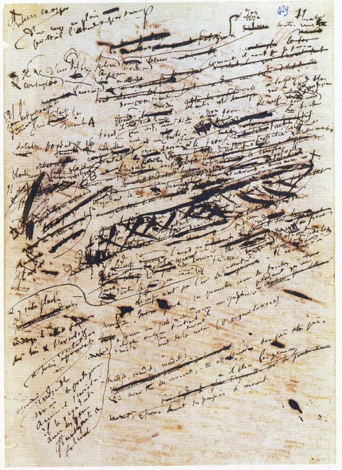

moke your docs
================

goal
-------
- 轻量化，方便编辑
- 方便协作，多人编辑维护
- 方便维护，方便迭代，方便版本管理
- 方便发布
- 简单明了的操作

写文档的过程
-------------

- 文档的完成不是一蹴而就的，是反复迭代，反复修正的，循序渐进的过程

::

   福楼拜 -- 据考，他手稿平均每页至少删掉百分之四十。他的笔有如犀利的手术刀，他常常对自己的创作无情删除，有时甚至将其精心创作的原稿全部推翻。
   福楼拜对写作有一种宗教般的虔诚，所以他能够精心锤锻出文学史上真正的杰作。检视他的手稿，有时候简单一页纸居然会被推翻重写十到十五次。

git 版本管理
---------------

#. `learn git branching <https://learngitbranching.js.org/>`__
#. `git book <https://git-scm.com/book/zh/v2>`__
#. `图解Git <https://marklodato.github.io/visual-git-guide/index-zh-cn.html>`__
#. `GitLab Docs <https://docs.gitlab.com/ee/README.html>`__
#. `github-cheat-sheet <https://github.com/tiimgreen/github-cheat-sheet/blob/master/README.zh-cn.md>`__

文档编辑
---------

reStructuredText
^^^^^^^^^^^^^^^^^

#. `reStructuredText <https://docutils.sourceforge.io/rst.html>`__
#. `reStructuredText入门 <http://www.pythondoc.com/sphinx/rest.html>`__
#. `Docutils 项目文档概述 <https://docutils-zh-cn.readthedocs.io/zh_CN/latest/index.html>`__
#. `使用ReadtheDocs托管文档  <https://www.xncoding.com/2017/01/22/fullstack/readthedoc.html>`__

markdow
^^^^^^^

latex
^^^^^^

#. `latexstudio <https://www.latexstudio.net/articles/>`__
#. `TeXdoc Online <http://www.texdoc.net/>`__
#. `Standard Document Classes for LATEX <https://www.latex-project.org/help/documentation/classes.pdf>`__
#. `LATEX2e 插图指南 <http://www.ctex.org/documents/latex/graphics/graphics.html>`__
#. `一份不太简短的LaTeX2e介绍 <https://www.latexstudio.net/archives/6058.html>`__

AsciiDoc
^^^^^^^^^

#. `AsciiDoc User Guide <https://asciidoc.org/userguide.html>`__
#. `Editing AsciiDoc with Live Preview <https://asciidoctor.org/docs/editing-asciidoc-with-live-preview>`__

GitHUb Wiki
^^^^^^^^^^^^

#. `GitHub Wiki <https://lpd-ios.github.io/2017/07/11/GitHub-Wiki-Introduction/>`__

GitBook
^^^^^^^^

#. `GitBook <http://caibaojian.com/gitbook/>`__

Sphinx
^^^^^^^^

#. `Sphinx <https://www.sphinx.org.cn/>`__
#. `Sphinx中文指南 <http://www.sphinxsearch.org/sphinx-tutorial>`__
#. `Sphinx 使用手册 <https://zh-sphinx-doc.readthedocs.io/en/latest/contents.html>`__

Arch-graph/UML 绘制
----------------------

Graphziv
^^^^^^^^

#. `Graphvic <http://www.graphviz.org/>`__
#. `Graphviz <https://graphviz.readthedocs.io/en/stable/index.html>`__
#. `Graphviz绘图 - DOT语言 <https://itopic.org/graphviz.html>`__
#. `dotguide <http://www.graphviz.org/pdf/dotguide.pdf>`__
#. `graphviz的基本语法及使用 <https://blog.csdn.net/mouday/article/details/80902992>`__
#. `GraphViz Pocket Reference <http://graphs.grevian.org/example>`__

assicflow
^^^^^^^^^^

#. `assicflow <http://asciiflow.com/>`__

plantuml
^^^^^^^^^

#. `PlantUML <https://plantuml.com/zh/>`__
#. `The Unified Modeling Language <https://www.uml-diagrams.org/>`__

GraphML
^^^^^^^^

#. `The GraphML File Format <http://graphml.graphdrawing.org/>`__
#. `Graph Markup Language <http://cs.brown.edu/people/rtamassi/gdhandbook/chapters/graphml.pdf>`__
#. `GraphML入门教程 <https://www.cnblogs.com/jssice/p/11476938.html>`__

draw.io
^^^^^^^^

#. `Diagram <https://www.diagrams.net/index.html>`__

yFiles
^^^^^^^^^

#. `yworks <https://www.yworks.com/>`__
#. `yEd Live <https://www.yworks.com/products/yed-live>`__

lucidchart
^^^^^^^^^^^

#. `Lucidchart <https://lucidchart.zendesk.com/hc/en-us/articles/207300186-Getting-Started-Guide>`__

